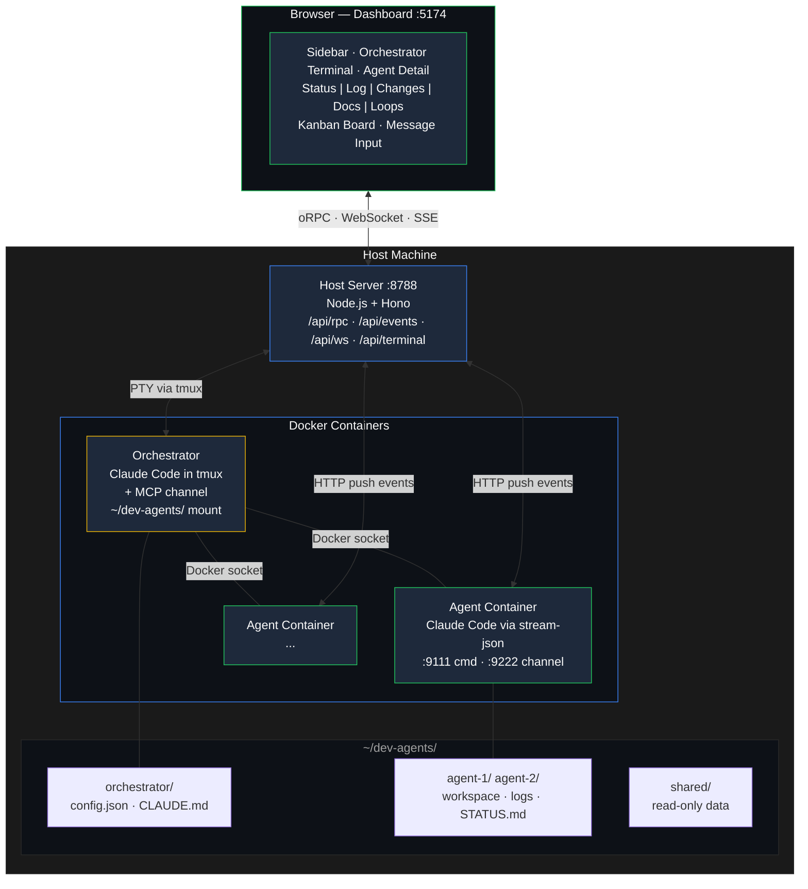

# dev-agents

Orchestrate isolated AI coding agents in Docker containers. A web dashboard provides real-time observability — embedded terminal, live session logs, git diffs, markdown docs, message injection, and a kanban board.

Built on Claude Code's stream-json and MCP channel protocols. Inspired by [cmux](https://github.com/greymd/cmux), [OpenAI Symphony](https://github.com/openai/symphony), and [harness engineering](https://openai.com/index/harness-engineering/) methodology.

## Architecture



## Features

- **Containerized orchestrator** — Claude Code runs in a Docker container with tmux, auto-starts on server launch, persists across browser tab close/reopen
- **Isolated agents** — each agent gets its own Docker container with a git clone of the project
- **Live terminal** — [ghostty-web](https://github.com/coder/ghostty-web) WASM terminal in the dashboard showing the orchestrator's Claude Code session
- **Structured log viewer** — parses stream-json output into readable format with tool call icons, markdown rendering, syntax highlighting, mermaid diagrams
- **Message injection** — send messages to agents mid-task (like `/btw`), works while agent is busy
- **Docs browser** — per-agent file browser showing CLAUDE.md, WORKFLOW.md, memory.md, config, and all markdown files
- **Git diff viewer** — color-coded diff view of agent's uncommitted changes
- **Kanban board** — task cards derived from agent status, mapped to lanes (Backlog → Done)
- **Loops** — recurring polling commands on agents with create/enable/disable/delete
- **Unread badges** — notification indicators on tabs and sidebar
- **Spawn dialog** — create agents from registered projects, local paths, or git URLs
- **Auto-discovery** — host server finds running agent containers on startup
- **Permission relay** — MCP-based permission flow from agent → orchestrator → verdict
- **SSO auth** — API key extracted from macOS Keychain, handles rotation

## Technology Stack

See [CLAUDE.md](CLAUDE.md) for rationale behind each choice.

| Layer | Technology |
|-------|-----------|
| Terminal | ghostty-web (WASM) |
| RPC | oRPC + Zod |
| Data fetching | React Query via oRPC |
| UI | React 19 + Tailwind v4 |
| Markdown | react-markdown + remark-gfm + rehype-highlight + mermaid |
| Build | Vite + Turborepo |
| Host server | Hono + Node.js (tsx) |
| Agent runtime | Bun (inside Docker) |
| PTY | node-pty (prebuilt) |
| Monorepo | pnpm workspaces |

## Quick Start

```bash
# Clone and install
git clone https://github.com/andrewluetgers/dev-agents.git
cd dev-agents
pnpm install

# Build the agent Docker image
docker build -t dev-agent:latest --build-arg AGENT_UID=$(id -u) ./image

# Start everything (server + dashboard)
pnpm dev
```

Open `http://localhost:5174`. The orchestrator container starts automatically with Claude Code in tmux. Click "Orchestrator" in the sidebar to see the terminal.

### First-time setup

For full setup including Docker ECI configuration, auth, and project registration:

```bash
claude
/dev-agents-init
```

## Monorepo Structure

```
dev-agents/
├── apps/
│   ├── server/                 # Host API server (Node.js + Hono + node-pty)
│   └── web/                    # Dashboard SPA (React + Vite + ghostty-web)
├── image/
│   ├── Dockerfile              # Agent container (node:22 + Claude Code + Playwright)
│   ├── server.ts               # In-container dual-protocol server
│   └── channel/
│       └── agent-channel.ts    # Orchestrator MCP channel
├── packages/
│   ├── rpc/                    # oRPC router (agents, projects, loops)
│   ├── shared/                 # Shared TypeScript types
│   └── typescript-config/      # Shared tsconfig
├── scripts/
│   ├── start-channel.sh        # MCP channel launcher (keychain auth)
│   └── get-claude-key.sh       # Extract API key from macOS Keychain
├── .claude/skills/             # Claude Code slash commands
├── templates/                  # Agent status template
├── CLAUDE.md                   # Technology decisions (do not change lightly)
├── turbo.json                  # Turborepo config
└── package.json                # Monorepo root
```

## Commands

```bash
pnpm dev                                # Start server (:8788) + dashboard (:5174)
pnpm --filter @dev-agents/server dev    # Server only
pnpm --filter @dev-agents/web dev       # Dashboard only
pnpm build                              # Build all
pnpm typecheck                          # Type-check all
```

## Agent Communication

Agents use two protocols simultaneously:

- **Stream-json** (stdin/stdout) — observability + message injection. Claude Code runs with `--input-format stream-json --output-format stream-json`. Output logged to file, broadcast via SSE, key events pushed to orchestrator.
- **MCP over HTTP** (:9222/mcp) — channel capabilities + permission relay. Agent's Claude Code connects to the local MCP server for `ask_orchestrator` and `report_status` tools.

## Port Assignments

| Port | Service | Location |
|------|---------|----------|
| 8788 | Host server (API + dashboard) | Host |
| 5174 | Vite dev server (HMR) | Host (dev only) |
| 9111 | Agent command server | Container |
| 9222 | Agent channel server | Container |
| 8789 | Orchestrator channel | Container |

## Further Reading

- [CLAUDE.md](CLAUDE.md) — technology decisions and architecture principles
- [docs/ARCHITECTURE.md](docs/ARCHITECTURE.md) — detailed system design and data flows
- [docs/INTERFACE-DESIGN.md](docs/INTERFACE-DESIGN.md) — dashboard layout and planned features
